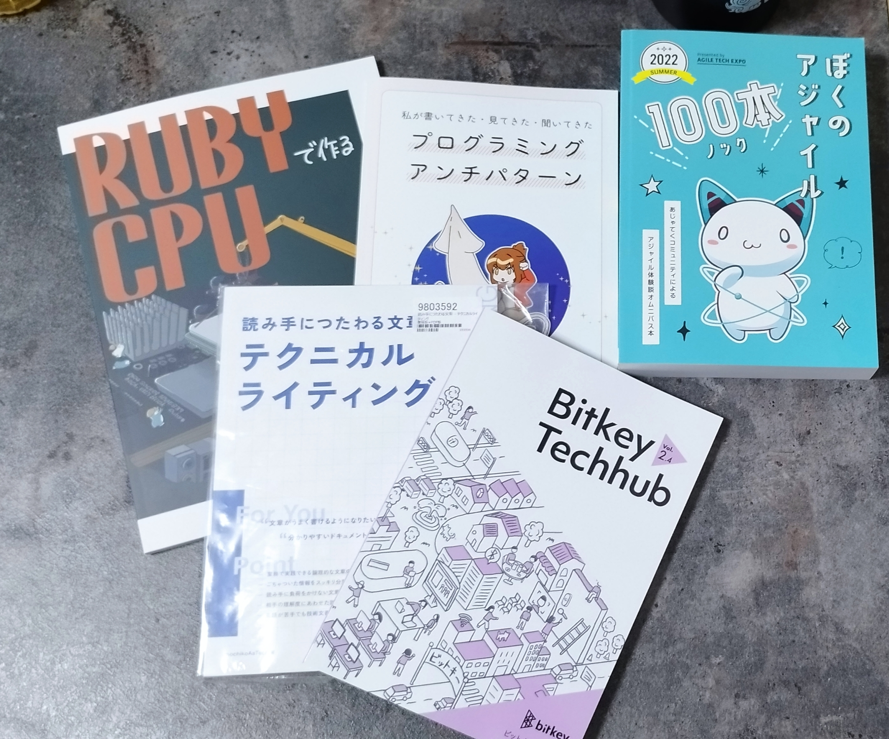

技術書典に初参加してきた！
https://techbookfest.org/event/tbf18/market

会場は思ったよりも広く、ブースも100以上は確実にあったはず。
かなりGeekな雰囲気を感じ、それぞれの分野に尖ってイキイキとした熱気を感じた。

## 戦利品

Web周りのブースはゆっくりじっくり見て回った。RubyKaigiのTシャツを着た方もいて、いくつか気になった本を購入した。

買った理由を述べていく。

### Rubyで作るCPU

低レイヤの話をRubyで楽しく学べそう

### プログラミングアンチパターン

表現が面白そうで、薄くてサクッと読めそうで気になった

### ぼくのアジャイル100本ノック

かなりの章立てで、理論というよりも体験談のTipsがまとまっていて、明日から使えそうな話がありそうだと思った

### テクニカルライティング

薄くて重要なことが書いてありそうで、こちらも明日から使えるTipsが書いてありそうだと思った

### Bikey Techhub

こちらは無料でした。QAにフォーカスし、振り返りの文化の話などの組織に当てた話があり気になった

## おわり

アプリの後払いの体験も良くて、熱気も得られて楽しいイベントでした！
